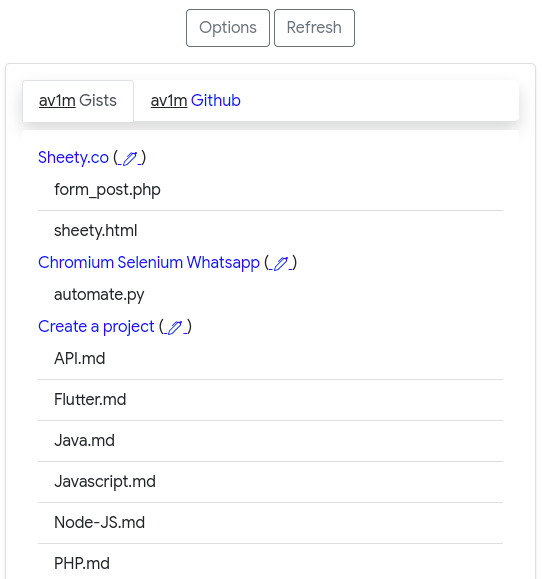

# Github & Gist extension

Browser extension to quickly access these Github deposits as well as these giets.
Possibility of adding a [token](https://docs.github.com/en/github/authenticating-to-github/keeping-your-account-and-data-secure/creating-a-personal-access-token) to access private elements (non-public)

## Screenshot 📸



## Get started 🎉

First, clone this project :

```bash
git clone https://github.com/av1m/github-extension
```

Then, go to :  
&rarr; Chrome
&rarr; In url, type `chrome://urls`

&rarr; Activate `Developer Mode`

&rarr; Click on `Load unpacked`

&rarr; Choose the directory  
&rarr; Click on the extension icon

## Documentation

* [API Reference - Google Chrome](https://developer.chrome.com/extensions)

## Repository available on Github :octocat:

* [Link of this repository](https://github.com/av1m/github-extension)

## License 📝

This project is under MIT license, you can consult the license [here](LICENSE)

## Authors 👨‍💻

* [av1m](https://github.com/av1m/)
